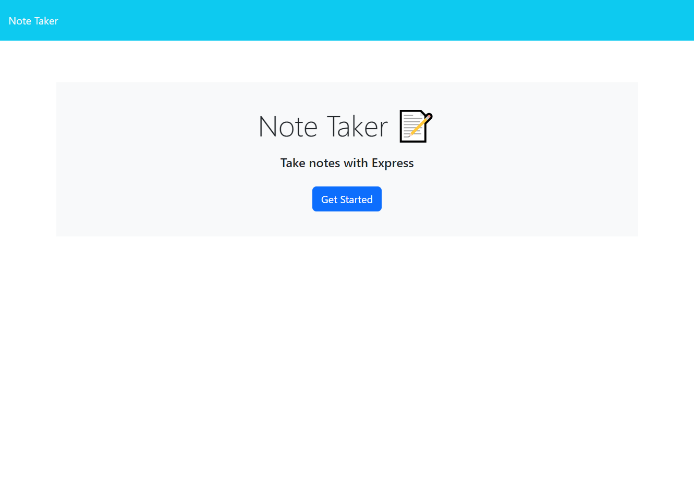

<h1 style="text-align: center">express.js-note-taker</h1>
 

# Link to deployed application
- GitHub Repo - https://github.com/JJGAvery/express.js-note-taker
- Heroku - https://dashboard.heroku.com/apps/vast-ravine-57034
- Video - 

# Description  
In this challenge I was provided with starter code to create a note taker. The front end code was provided. I was instructed to write the back end using express.js, connect the front and back end so the user will be able to save and retrieve note data from a json file. 

# Technologies
- HTML
- CSS
- JAVASCRIPT
- NODE.JS

# Installation Instructions
In the integrated terminal run npm install.

# Use of Project
To run the project, in the integrated terminal you will have to type node server.js. Then in your local browser you will enter http://localhost:3001/ into the address bar.

# Preview

 
